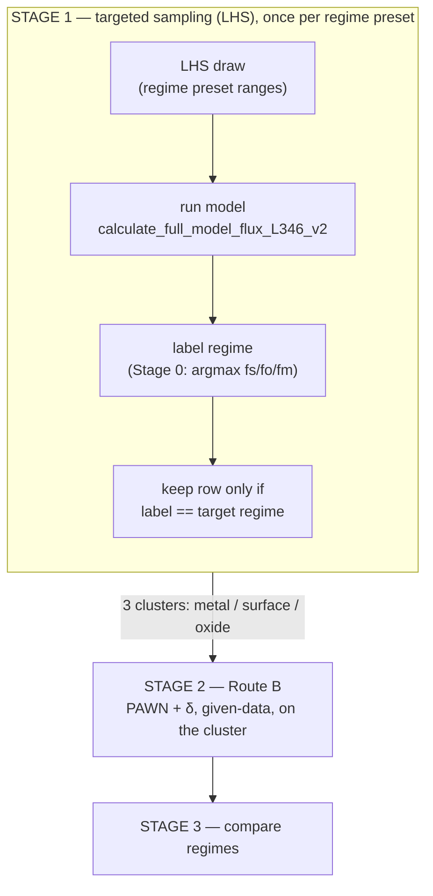

# Regime-Stratified Sensitivity Analysis — How It Works

A teaching guide to the regime-stratified sensitivity analysis (SA) for the **L5L6**
permeation model.

- **Engine:** [`calculations/sensitivity.py`](../calculations/sensitivity.py)
- **Analysis notebook:** [`Application/sensitivity_regime_L5L6.ipynb`](../Application/sensitivity_regime_L5L6.ipynb)
- **Visualization notebook:** [`Application/regime_parallel_coords.ipynb`](../Application/regime_parallel_coords.ipynb)
  (parallel-coordinates plots — see §6)
- **Run with:** the `mace_env` conda kernel
  (`/Users/akinyemi.az/anaconda3/envs/mace_env/bin/python`). The base anaconda env is broken
  (numpy 2.3.4 vs numpy-1.x-compiled deps).
- **Parameters varied: 36.** The four reference temperatures (`T_ref_*`) are held **fixed** — see the scope note below.

---

## 0. The one-sentence idea

> **Sensitivity analysis** asks *"if I wiggle each input parameter, how much does the output
> (flux) wiggle?"* — i.e. **which parameters matter most.** We added a twist: **the answer
> depends on which physical regime the system is in**, so we compute the sensitivity
> *separately for each regime.*

### The basic analogy

The hydrogen barrier has three steps in series, like three resistors in a wire:

```
   gas ──[ R_surface ]──[ R_oxide ]──[ R_metal ]──> downstream
          dissociation    oxide        metal
                          diffusion    diffusion
```

The **biggest resistor is the bottleneck**. Which one is biggest = the **regime**:

- `R_surface` biggest → **surface-limited**
- `R_oxide` biggest → **oxide-limited**
- `R_metal` biggest → **metal-limited**

The parameters that matter for flux are *different in each regime* (surface-kinetics params in
the surface regime, metal-transport params in the metal regime, …). A normal SA blends all
regimes and hides this. **We separate them.**

> **Scope note — 36 parameters (T_ref fixed).** In the model's `X(T)=X_ref·exp(-E/R·(1/T-1/T_ref))`,
> the reference temperature `T_ref` is *measurement metadata* (the temperature the reference value was
> taken at) and is redundant with `X_ref` via the prefactor `A=X_ref·exp(E/(R·T_ref))`. Varying it
> independently injects an artificial ~10³–10⁴ prefactor sweep, so the four `T_ref_*` are held **fixed**
> and the SA varies **36** parameters. Property uncertainty is captured through the `*_ref` and
> activation-energy (`E_*`) ranges instead. (The operating `temperature`, 573–1273 K, *is* varied.)

---

## 1. The ENTIRE workflow

One self-contained pipeline: aim the sampling at a regime, label every draw as it comes in, keep
the in-regime rows, then run given-data sensitivity directly on those rows.



**Why it's drawn this way:** Stage 0 (`assign_regime`) is *not* a phase that runs before Stage 1 —
it's one line of logic invoked once per LHS-drawn sample, immediately after that sample's model
run, nested inside Stage 1's loop (the box above). It cannot run any earlier: it needs the
flux-weighted fractions, which only exist after a model run, which only exists after a parameter
draw. Repeat the loop a few thousand times per regime preset → three clusters (metal/surface/oxide)
of real, unfiltered (input, output) pairs. Route B runs directly on those — no extra sampling, no
box, no leakage.

**Plain walk-through:**

1. Random sampling almost never produces surface-limited cases (0 in 1500 random runs), so we
   **aim** the sampling at each regime with a preset, labeling and filtering every draw as it
   comes in (Stage 0 nested inside Stage 1) → three clean data piles.
2. Route B (PAWN, δ) runs directly on those piles — no extra model evaluations.
3. **Stage 3** — line the regimes up and see how the important parameters differ.

> **Why no Morris or Sobol?** Both need a *structured* sample — Morris intact trajectories, Sobol
> paired A/B (Saltelli) matrices — and filtering such a sample by regime destroys the design. A
> regime-conditioned Sobol therefore has to resample a rectangular sub-box and accept leakage
> across the (curved) regime boundary, which makes it a weaker answer than the given-data
> estimators that need no design at all. That path was removed; this pipeline is given-data only.

---

## 2. Each stage as its own mini-workflow

### STAGE 0 — Regime labeling

```
 params ─► calculate_full_model_flux_L346_v2 ─► flux_weighted_resistances
                                                  │  fraction_surface
                                                  │  fraction_oxide
                                                  │  fraction_metal   (sum = 1.0)
                                                  ▼
                                   assign_regime(fs, fo, fm)
                                                  │
                            ┌─────────────────────┼─────────────────────┐
                          fs biggest           fo biggest            fm biggest
                            ▼                     ▼                     ▼
                        "surface"              "oxide"               "metal"
                            (NaN inputs → "undefined", thrown away)
```

**Why:** turns a continuous result into one clean label so we can group runs. `argmax` = "pick the
biggest of the three" (no fuzzy "mixed" bucket). Code: `assign_regime()`, attached inside
`level5L6_model_wrapper(..., return_full_record=True)`.

**Not a separate temporal phase:** this runs once per sample, immediately after that sample's
model call, nested inside Stage 1's LHS loop (see the flowchart in §1) — there is no standalone
"Stage 0 pass" that runs over a batch of already-existing data before sampling starts.

---

### STAGE 1 — Targeted sampling (per regime)

```
 for each regime R in {metal, surface, oxide}:

   REGIME_PRESETS[R]            ← input ranges tuned to PRODUCE regime R
        │
        ▼
   latin.sample (LHS)           ← space-filling draws over those ranges
        │   N draws
        ▼
   run model on each draw       ← run_global_lhs_scan(...)
        │   (tag each with regime via Stage 0)
        ▼
   keep rows where regime == R  ← the "cluster" for R
        │
        ▼
   warn if cluster < ~300-500   ← need enough points for stable stats
```

**Why a preset per regime?** A plain random sweep gave **metal 97%, oxide 3%, surface 0%** —
surface-limited is so rare you'd never get a usable pile. Each preset nudges inputs toward the
corner that produces that regime (surface = *low pressure + slow surface kinetics*; oxide =
*suppressed defects + slow/thick oxide + fast surface & metal*), while leaving every other
parameter at full range so the sensitivity result stays honest. Code: `run_targeted_regime_scans()`.
The production run (36-param) gave in-regime clusters of **metal 813, surface 714, oxide 3725** — all
comfortably above the ~300–500 floor.

> **LHS (Latin Hypercube Sampling):** a smart way to scatter sample points so they evenly cover
> every input's range (better than pure random). *Source: McKay, Beckman & Conover (1979),
> Technometrics 21(2):239–245.*

---

### STAGE 2 — ROUTE B (the answer)

```
 cluster_R (true pile of in-regime points)
        │
        │  X = the input columns,  Y = an output (flux → log10, theta linear)
        ▼
   ┌──────────────────────────────┬───────────────────────────────┐
   │ PAWN.analyze(X, Y)            │ delta.analyze(X, Y)           │
   │ → "median" KS distance        │ → "delta" (∈[0,1]) + S1        │
   │   per parameter               │   per parameter                │
   └──────────────────────────────┴───────────────────────────────┘
        │
        ▼
   rank parameters per regime → top drivers of flux in THAT regime
```

**Why these two methods?** Classic Morris/Sobol need a *special structured sample*; you cannot feed
them an arbitrary filtered pile. **PAWN and δ are "given-data" methods — they work on any cloud of
(input, output) points.** That's exactly what an in-regime cluster is. No box, no leakage. Code:
`givendata_sensitivity_by_regime()`.

> **Caveat — what the cluster actually is.** A cluster is not a uniform sample of its regime; it is
> *LHS over a rectangular preset box, intersected with the regime's true (curved) boundary*. δ and
> PAWN are therefore conditioned on that induced distribution, and the distribution differs per
> regime (surface keeps 28.6 % of its draws, oxide 74.5 %). Rankings *within* a regime are sound;
> cross-regime magnitude comparison is what §"Stage 3" column-normalization compensates for.

---

### STAGE 3 — Compare

```
 Route B results (all regimes, all metrics)
        │
        ▼
 regime_comparison_matrix  →  parameter × regime grid of δ (or PAWN)
        │                       (union of each regime's top drivers)
        ▼
 plot_regime_comparison_heatmap  +  compare_<index>_<metric>.csv
```

**Why:** the payoff — one picture showing *"temperature matters in all regimes, but `f_crack` only
matters in oxide, `k_diss_metal` only in surface, `gb_diffusivity` only in metal."* Code:
`regime_comparison_matrix()` / `plot_regime_comparison_heatmap()`.

**Reading the heatmap (column-normalized by default).** Raw δ is not comparable across columns:
the surface cluster's δ values are systematically smaller (max 0.390) than metal's (0.546) or
oxide's (0.553), so on one global colour scale the surface column looks uniformly cool even where a
parameter is proportionally *more* important there — and `temperature` saturates the top of the
scale, leaving everything else near-white. `plot_regime_comparison_heatmap(..., normalize='column')`
(the default) divides each column by its own maximum, so every regime spans a full 0→1 scale and
each cell reads as *"fraction of this regime's strongest driver."*

Because column-normalization divides magnitude out, each cell is **dual-encoded**:

| element | encodes |
|---|---|
| fill colour + large centred number | column-normalized value (column max = 1.00) |
| small boxed number, upper-right corner | **raw** δ / PAWN value |

So `temperature` reads `1.00` in all three columns, but its corners still show `0.546 / 0.553 /
0.390` — the cross-regime magnitude difference is preserved. Pass `normalize=None` for the old
raw-only heatmap, or `show_raw=False` to drop the corner annotations. The exported
`compare_<index>_<metric>.csv` files are always **raw** — normalization is display-only.

> Column-normalization fixes cross-column comparability, not the fact that `temperature` dominates
> *within* every column (it is the column max, so it defines 1.00). The remaining parameters still
> live in the lower ~0.4 of the scale.

---

## 3. The two SA methods in plain words

Both are **given-data** (moment-independent) estimators — the property that makes them valid on a
regime-filtered cluster. Neither gives a variance decomposition, so there are no S1/ST shares and
no pairwise interaction terms in this pipeline.

| Method | The question it answers | How | Needs special sample? |
|---|---|---|---|
| **PAWN** (distribution) | "How much does the output's *distribution shape* change when I pin this input?" | Kolmogorov–Smirnov distance between conditioned vs free output CDFs | **No** (any data) |
| **Borgonovo δ** (density) | "How much does the output's *probability density* shift when I pin this input?" δ∈[0,1] | Area between conditioned vs unconditioned densities | **No** (any data) |

> **Why we log₁₀ the flux first:** flux spans ~10 orders of magnitude. Variance- and density-based
> methods get hijacked by a few giant values (δ came out as 46 and −93389 — impossible, δ must be in
> [0,1]). Taking log₁₀ fixes it: we measure what controls the *order of magnitude* of flux, which is
> what you actually care about. `theta` (already 0–1) stays linear. Controlled by `LOG_METRICS_DEFAULT`.

---

## 4. Stage → code map

| Stage | Functions in `calculations/sensitivity.py` |
|---|---|
| 0 — regime label | `assign_regime`, `level5L6_model_wrapper(return_full_record=True)` |
| 1 — targeted scans | `REGIME_PRESETS`, `DEFAULT_N_PER_REGIME`, `run_global_lhs_scan`, `run_targeted_regime_scans`, `load_regime_scans`, `partition_by_regime`, `plot_regime_exploration` |
| 2 — Route B | `givendata_sensitivity_by_regime`, `summarize_givendata`, `plot_givendata_results` |
| 2 — geometry | `plot_regime_geometry` |
| 3 — compare | `regime_comparison_matrix`, `plot_regime_comparison_heatmap` |
| 6 — parallel coords | `parallel_coordinates_samples`, `parallel_coordinates_sensitivity`, `top_drivers` (notebook `regime_parallel_coords.ipynb`) |
| helpers | `_make_problem`, `_givendata_problem`, `_save_scan`, `_column_normalize`, `_pcp_axis` |

---

## 5. Saved data & caching (avoid re-running)

Everything is written to CSV under **`Application/sa_results/`** (set by `RESULTS_DIR` in the
notebook config cell). The notebook **caches the model evaluations**: on the first run it computes
and saves; on later runs it **reloads the CSVs and skips the expensive model calls** (the cheap
SA analysis is recomputed). To recompute from scratch, set `FORCE_RECOMPUTE = True` or delete the
folder.

| File | What it holds | Reused to skip… |
| --- | --- | --- |
| `scans/scan_metal.csv`, `scan_surface.csv`, `scan_oxide.csv` | every LHS draw per regime (36 params + outputs + regime) | the targeted scans (biggest cost) |
| `master_clusters.csv` | all in-regime rows combined | — (convenience) |
| `routeB_givendata.csv` | tidy PAWN median, δ, given-data S1 per regime/metric/param | — (Route B is already eval-free) |
| `compare_<index>_<metric>.csv` | parameter × regime comparison matrices | — (result table) |

**Caching is keyed by file existence + sample size/seed**, implemented via `load_regime_scans` for
the scans — the only step that costs model evaluations. If you change `N_PER_REGIME` or `SEED`,
delete `sa_results/` (or set `FORCE_RECOMPUTE = True`) so the caches are rebuilt to match.

---

## 6. Parallel-coordinates plots (Plotly)

Interactive views of the results, built **from the saved CSVs** (no recompute) in the standalone
notebook [`Application/regime_parallel_coords.ipynb`](../Application/regime_parallel_coords.ipynb).
Each is written to `sa_results/figures/*.html` and also renders inline. Functions:
`parallel_coordinates_samples`, `parallel_coordinates_sensitivity`, `top_drivers`.

| View | Shows | Source CSV | Axes / colour |
| --- | --- | --- | --- |
| **A** `pcp_A_regime.html` | regime manifold in parameter space | `master_clusters.csv` | union of regimes' top-δ drivers (+ log10 flux); colour = **regime** |
| **B** `pcp_B_<regime>.html` | within-regime structure (one per regime) | `master_clusters.csv` (one regime) | that regime's top-6 drivers; colour = **log10(flux)** |
| **C** `pcp_C_sensitivity.html` | how each parameter's δ shifts across regimes | `compare_delta_flux.csv` | leftmost = **parameter name**, then metal/oxide/surface; colour = mean importance |
| **D** `pcp_D_outputs.html` | regime separation in output space | `master_clusters.csv` | flux, theta, frac_\*, permeability; colour = **regime** |

Notes:
- Heavy-tailed columns (P, k_diss, thicknesses, flux, …) are shown on **log10** axes; regimes are
  coloured discretely (surface/oxide/metal).
- **Identifying lines:** `go.Parcoords` has no per-line legend or hover, so view **C** adds a leftmost
  categorical **parameter** axis (sorted by importance, highest on top) — every line traces back to its
  parameter. `parallel_coordinates_sensitivity(..., top_n=N)` trims to the N most important.
- **Layout:** plots with many axes (view A, 11) get a pinned wide width so titles don't overlap;
  few-axis plots stay responsive (fill the cell). Tunable via `width`/`labelangle` args.
- Interactivity: drag along any axis to **brush/filter**. Static PNG export needs `pip install kaleido`.

---

## 6b. The Level 5 variant (no surface kinetics)

`Application/sensitivity_regime_L5.ipynb` runs the same pipeline on `level5_model_wrapper`.
Three differences matter.

**Different regimes — oxide / metal / defect.** With no surface step there are only two series
resistances, so the third competitor is the *parallel* bypass through pinholes, cracks and
grain-boundary paths:

```
frac_oxide  = (P_up - P_int)/P_up * (1 - frac_defect)     series split, taken from the
frac_metal  =  P_int/P_up        * (1 - frac_defect)      solved interface pressure
frac_defect =  J_defect / J_total                         parallel bypass
```

The series split uses the interface pressure directly rather than
`calculate_metal_resistance`, whose Taylor form assumes small dP while these sweeps run
`P_downstream = 0`. Both definitions were compared on a 300-draw probe and agreed on 99.0% of
rows (corr 0.987). Code: `assign_regime_L5`, `REGIME_PRESETS_L5`.

**Targeting is the study, not a convenience.** Over the default ranges L5 is ~98%
metal-limited with `max frac_defect = 0.415` — one regime, nothing to stratify. Yields at
fixed T are in `MEASURED_YIELDS_L5_BY_T`; the oxide yield falls 0.92 -> 0.59 from 773 K to
1273 K because the oxide's activation energies exceed the metal's, so draw counts are sized
per temperature.

**It is run isothermally — and this is the important lesson.** With `temperature` varying it
monopolises the variance of log10(flux): a dummy-parameter test put it at delta ~0.50 and
*every other parameter at or below the noise floor of ~0.09*. Sampling harder does not help —
the floor is flat in n (0.085 at n=400, 0.092 at n=1500), because delta's bias for an
irrelevant input does not shrink with sample size. Pinning temperature via
`run_global_lhs_scan(fixed_params=...)` (with `presets_without(..., 'temperature')` removing
it from the sampled set) is what lets the rest compete.

### Always read the floor column

`givendata_sensitivity_by_regime(..., n_dummy=3)` appends dummy inputs the model never sees
and reports `floor` = their best delta. `summarize_givendata` exports `floor` and
`delta_over_floor`. **A parameter at or below 1.0x is not resolved.** Without this a table of
pure noise reads exactly like a ranking — which is how an earlier small-n run produced three
convincing but entirely spurious per-regime driver lists.

Two cautions on the floor itself: with only 3 dummies it is the max of 3 draws and so
*underestimates* the upper tail of the noise distribution — treat 1.0-1.5x as suggestive, not
established, and raise `n_dummy` if a marginal result matters. And the floor differs per
cluster (0.076-0.102 here) even at equal n, because it depends on the output distribution, so
raw delta is not comparable across regime columns.

### What the isothermal L5 run found

Clusters of ~1500 at each of 773 / 1073 / 1273 K:

| regime | resolved drivers of log10(flux) | note |
|---|---|---|
| oxide | `H_sol_ox` at **2.4x / 5.0x / 5.5x** the floor | the one unambiguous result; strengthens with T |
| metal | `K_s_ref`, `D_ref`, `metal_thickness` (1.5-2.0x) | Sieverts transport, stable across T |
| defect | `K_s_ref`, `D_ref`, `H_sol_ox`, `metal_thickness` (1.6-2.8x) | metal parameters dominate — the bypass still crosses the metal |

`PRF` medians confirm the labels physically: ~27-33 in the oxide cluster (an intact barrier),
~1.00 in metal (no barrier), ~1.19-1.56 in defect (barrier largely defeated).

Note what is *absent*: the defect area fractions themselves (`f_pinhole`, `f_crack`) sit at
1.0-1.5x inside the defect cluster. Once a run is in that regime, what remains rate-limiting
is transport through the metal beneath the bypass, not the size of the bypass.

---

## 6c. Known limitations of PAWN and delta — read before interpreting any table

The two estimators this pipeline relies on have documented failure modes. They bear directly
on how the results above may and may not be read.

### The dummy parameter is the standard significance test

Neither delta nor PAWN returns zero for an input that does nothing — both are finite-sample
estimates, and noise does not average to exactly zero. The accepted remedy, introduced by the
PAWN authors themselves (Pianosi & Wagener 2018), is to add a **dummy parameter** that the
model never sees and treat its index as the significance threshold: inputs scoring
appreciably above the dummy are classified as sensitive, the rest are not resolved.

That is what `givendata_sensitivity_by_regime(..., n_dummy=N)` implements, and what the
`floor` / `delta_over_floor` columns report. `floor = max(dummy indices)`, so it is an order
statistic: **`n_dummy=3` underestimates the noise ceiling and inflates every margin.** Measured
on the L5 clusters, raising `n_dummy` from 3 to 20 lifted the floor by 9-34% and cut the count
of parameters above 1.0x from 21 to 8 in the defect regime. Use `n_dummy >= 20` for anything
that will be published.

### Below the floor does NOT mean "no physical effect"

This is the most important caveat in this document, and the easiest to get wrong.

Puy, Lo Piano & Saltelli (2020) ran a sensitivity analysis *of PAWN*. On the Morris test
function, inputs `X11...X20` are genuinely influential but act **purely through interactions**.
Their result:

> "the volatility in the computation of PAWN does not allow to distinguish X11,...,X20 from a
> dummy, non-influential model input"

and in their conclusions:

> "the PAWN index might be incapable to differentiate between non-influential model inputs and
> influential model inputs whose effect in the model output is fully through interactions"

So a below-floor index means **undetected by this estimator on this sample**, not "no effect".
A parameter whose influence is conditional on other parameters is exactly the case these
methods are documented to miss.

**Worked example from this model.** `f_pinhole` scores at or below the floor in the L5 metal
cluster. It would be wrong to conclude pinholes do not matter: a pinhole exposes bare metal, so
hydrogen enters as if the oxide were absent — which is precisely how the defect path is built
(`calculate_defect_path_flux_defective_metal`). The effect is real; it is *interactive*,
because how much a bypass buys you depends on how much resistance the oxide was contributing.
In the metal-limited regime the oxide was not the bottleneck, so the marginal gain is small —
and an interaction-driven, small-marginal-effect input is the exact blind spot above.

### Two further findings that apply to this model

**High dimensionality is a red flag.** Puy et al.:

> "PAWN especially underperformed when used in the Sobol' G (k = 8) and the Morris (k = 20)
> function. This raises a red flag for analysts when using PAWN in high-dimensional models such
> as those commonly being employed in the Earth and Environmental Sciences domain, which might
> easily include tens of parameters."

This pipeline varies **28** parameters (L5) and **36** (L5L6).

**Inputs of very different magnitude bias the ranking.** Puy et al. cite Mora et al. (2019):
the noise in PAWN "might produce biased rankings when the model inputs have different orders of
magnitude in their contribution to the response" — which is exactly the `temperature`-dominance
problem that motivated the isothermal design in section 6b.

### What is configured correctly here

- `S=10` conditioning intervals matches Pianosi & Wagener's guidance (start at n=10, vary a few
  units, keep n>5).
- Cluster sizes ~1500 sit inside the N in (200, 2000) range Puy et al. tested, near the N ~ 2000
  point at which PAWN was close to convergence.
- **Median**, not max, as the PAWN summary statistic. Puy et al. found the choice of summary
  statistic is the largest single contributor to PAWN index variance, and that excluding `max`
  "provides a more robust account". SALib's `pawn_median` is the right column to read.

### Practical consequences

1. Report **delta and PAWN together** and check they agree. The critique above is PAWN-specific;
   delta is a different estimator with different failure modes, so divergence is informative.
2. Never read a below-floor result as evidence of no effect. State it as "not resolved".
3. For a mechanistic question about one parameter ("does opening a pinhole increase flux?"),
   a global variance/density measure is the wrong instrument. Use a **conditional sweep**
   (section 6d) as a complement — it can detect exactly the interaction-driven effects these
   estimators are documented to miss.

---

## 6d. Conditional sweep — the complement for mechanistic questions

Delta and PAWN answer a *variance/density* question: "how much of the spread in the output does
this input account for, while everything else is also varying?" They cannot answer a
*mechanistic* one: "if I open a pinhole, does flux go up, and by how much?" Those are different
questions, and §6c shows the global estimators can return a below-floor index for an input whose
mechanism is real but interaction-dependent.

The conditional sweep answers the mechanistic question directly.

```
 pick M baselines at random FROM the regime's own cluster
        │      (real in-regime parameter vectors, not one arbitrary nominal point)
        ▼
 for each baseline:
     hold all other parameters at that baseline's values
     vary the parameter of interest across its full range (log grid)
     run the model at each grid point
        │
        ▼
 per baseline: swing = log10( flux_max / flux_min )
        │
        ▼
 report the DISTRIBUTION of swing across the M baselines,
 and compare the same sweep between regimes
```

**Why M baselines rather than one.** A single one-at-a-time sweep is local to whatever nominal
point you chose, and Saltelli & Annoni (2010) rightly criticise OAT used as a *substitute* for
global SA: one point explores a vanishing fraction of the input space and sees no interactions.
Drawing the baselines from the cluster itself fixes the sampling objection — every baseline is a
genuine in-regime condition — and reporting the spread of the response, rather than a single
number, exposes exactly how much the effect depends on the rest of the parameters. A wide swing
distribution *is* the interaction, made visible.

**What it is not.** It is still conditional, not a global index. It complements delta/PAWN; it
does not replace them, and it should never be reported as a sensitivity index.

**Reading it.** Comparing the same sweep across regimes is the informative part. For
`f_pinhole` the expectation is a large swing in the oxide-limited cluster (the bypass removes
the actual bottleneck) and a small one in the metal-limited cluster (the oxide was not the
bottleneck, so bypassing it changes little) — a small-but-real marginal effect, which is
consistent with a below-floor delta and with the mechanism being genuine.

---

## 7. Sources

**Borgonovo δ (moment-independent importance):**

- Borgonovo, E. (2007). *A new uncertainty importance measure.* **Reliability Engineering & System
  Safety**, 92(6), 771–784. doi:10.1016/j.ress.2006.04.015 — the original δ measure.
- Plischke, E., Borgonovo, E., & Smith, C. L. (2013). *Global sensitivity measures from given data.*
  **European Journal of Operational Research**, 226(3), 536–550. doi:10.1016/j.ejor.2012.11.047 —
  the "given-data" estimator that **SALib actually implements**.

**PAWN (CDF / distribution-based):**

- Pianosi, F., & Wagener, T. (2015). *A simple and efficient method for global sensitivity analysis
  based on cumulative distribution functions.* **Environmental Modelling & Software**, 67, 1–11.
  doi:10.1016/j.envsoft.2015.01.004 — the original PAWN method.
- Pianosi, F., & Wagener, T. (2018). *Distribution-based sensitivity analysis from a generic
  input–output sample.* **Environmental Modelling & Software**, 108, 197–207.
  doi:10.1016/j.envsoft.2018.07.019 — the given-data version SALib uses.

**Critique / limitations (see §6c):**

- Puy, A., Lo Piano, S., & Saltelli, A. (2020). *A sensitivity analysis of the PAWN sensitivity
  index.* **Environmental Modelling & Software**, 127, 104679.
  doi:10.1016/j.envsoft.2019.104679 (arXiv:1904.04488) — PAWN's dependence on its design
  parameters (N, n, ε, θ); the interaction blind spot; the high-dimensionality warning.
- Mora, E. B., Spelling, J., & van der Weijde, A. H. (2019). *Benchmarking the PAWN
  distribution-based method against the variance-based method in global sensitivity analysis.*
  **Environmental Modelling & Software**, 122. doi:10.1016/j.envsoft.2019.104556 — noise-driven
  bias when inputs differ by orders of magnitude in their contribution.
- Saltelli, A., & Annoni, P. (2010). *How to avoid a perfunctory sensitivity analysis.*
  **Environmental Modelling & Software**, 25(12), 1508–1517. doi:10.1016/j.envsoft.2010.04.012 —
  why one-at-a-time sweeps must complement, never replace, a global analysis.

**Supporting methods also used:**

- McKay, M. D., Beckman, R. J., & Conover, W. J. (1979). **Technometrics**, 21(2), 239–245 —
  Latin Hypercube Sampling.
- Herman, J., & Usher, W. (2017). *SALib: an open-source Python library for sensitivity analysis.*
  **Journal of Open Source Software**, 2(9), 97. doi:10.21105/joss.00097 — the library implementing
  all of the above.
