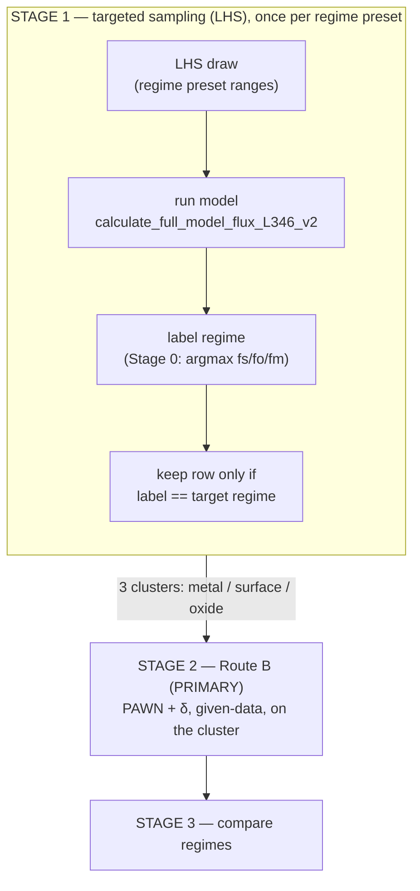
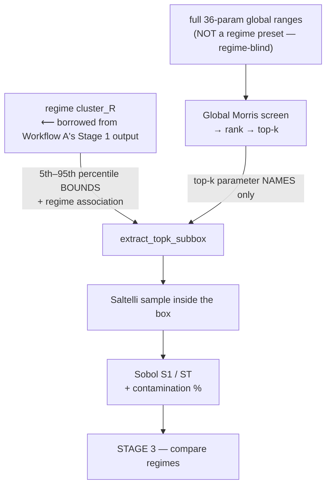

# Regime-Stratified Sensitivity Analysis — How It Works

A teaching guide to the regime-stratified sensitivity analysis (SA) for the **L5L6**
permeation model.

- **Engine:** [`validation/sensitivity_level1.py`](../validation/sensitivity_level1.py)
- **Analysis notebook:** [`Application/sensitivity_regime_L5L6.ipynb`](../Application/sensitivity_regime_L5L6.ipynb)
- **Visualization notebook:** [`Application/regime_parallel_coords.ipynb`](../Application/regime_parallel_coords.ipynb)
  (parallel-coordinates plots — see §6)
- **Run with:** the `mace_env` conda kernel
  (`/Users/akinyemi.az/anaconda3/envs/mace_env/bin/python`). The base anaconda env is broken
  (numpy 2.3.4 vs numpy-1.x-compiled deps).
- **Parameters varied: 36.** The four reference temperatures (`T_ref_*`) are held **fixed** — see the scope note below.

---

## 0. The one-sentence idea

> **Sensitivity analysis** asks *"if I wiggle each input parameter, how much does the output
> (flux) wiggle?"* — i.e. **which parameters matter most.** We added a twist: **the answer
> depends on which physical regime the system is in**, so we compute the sensitivity
> *separately for each regime.*

### The basic analogy

The hydrogen barrier has three steps in series, like three resistors in a wire:

```
   gas ──[ R_surface ]──[ R_oxide ]──[ R_metal ]──> downstream
          dissociation    oxide        metal
                          diffusion    diffusion
```

The **biggest resistor is the bottleneck**. Which one is biggest = the **regime**:

- `R_surface` biggest → **surface-limited**
- `R_oxide` biggest → **oxide-limited**
- `R_metal` biggest → **metal-limited**

The parameters that matter for flux are *different in each regime* (surface-kinetics params in
the surface regime, metal-transport params in the metal regime, …). A normal SA blends all
regimes and hides this. **We separate them.**

> **Scope note — 36 parameters (T_ref fixed).** In the model's `X(T)=X_ref·exp(-E/R·(1/T-1/T_ref))`,
> the reference temperature `T_ref` is *measurement metadata* (the temperature the reference value was
> taken at) and is redundant with `X_ref` via the prefactor `A=X_ref·exp(E/(R·T_ref))`. Varying it
> independently injects an artificial ~10³–10⁴ prefactor sweep, so the four `T_ref_*` are held **fixed**
> and the SA varies **36** parameters. Property uncertainty is captured through the `*_ref` and
> activation-energy (`E_*`) ranges instead. (The operating `temperature`, 573–1273 K, *is* varied.)

---

## 1. The ENTIRE workflow

This pipeline is really **two separate workflows** that share the same model and both report into
Stage 3 — they do not feed into each other in a simple chain. **Workflow A** is fully
self-contained (its own sampling, its own analysis, the primary answer). **Workflow B** needs an
extra ingredient *borrowed* from Workflow A's output, plus an independent sampling pass of its own.
Trying to draw both as one linear flow is what makes this pipeline confusing, so here they are
separately.

### Workflow A — the primary path (LHS → Route B)



**Why it's drawn this way:** Stage 0 (`assign_regime`) is *not* a phase that runs before Stage 1 —
it's one line of logic invoked once per LHS-drawn sample, immediately after that sample's model
run, nested inside Stage 1's loop (the box above). It cannot run any earlier: it needs the
flux-weighted fractions, which only exist after a model run, which only exists after a parameter
draw. Repeat the loop a few thousand times per regime preset → three clusters (metal/surface/oxide)
of real, unfiltered (input, output) pairs. Route B runs directly on those — no extra sampling, no
box, no leakage.

### Workflow B — the secondary path (Morris → Sobol / Route A), borrowing from Workflow A



**Why it's drawn this way:** Morris runs once, independently, over the *full* 36-parameter space —
it never sees or uses a regime label (see "Global Morris screen" below). It only supplies *which*
parameters matter (top-k names), the same list reused for all three regime boxes. The actual
numeric bounds for each box — and the regime association itself — are **borrowed** from Workflow
A's already-collected cluster (5th–95th percentile of that regime's own data). Only after both
ingredients are combined does a *fresh* Saltelli sample get drawn and run through the model — a
new, third sampling pass, separate from both LHS and Morris.

**Plain walk-through:**

1. **Workflow A** — random sampling almost never produces surface-limited cases (0 in 1500 random
   runs), so we **aim** the sampling at each regime with a preset, labeling and filtering every
   draw as it comes in (Stage 0 nested inside Stage 1) → three clean data piles → Route B (PAWN, δ)
   gives the honest, primary answer directly on those piles.
2. **Workflow B** — runs completely independently: a global, regime-blind Morris screen ranks all
   36 parameters and picks the top-k. Those names get combined with percentile bounds *borrowed*
   from Workflow A's clusters to build a rectangular box per regime.
3. Sobol needs that tidy box (classic Sobol can't consume an arbitrary filtered pile the way
   PAWN/δ can), so we accept the box leaks into neighbouring regimes and **report** how much
   (contamination %) rather than pretending it didn't happen.
4. **Stage 3** — line both workflows' regimes up and see how the important parameters differ.

---

## 2. Each stage as its own mini-workflow

### STAGE 0 — Regime labeling

```
 params ─► calculate_full_model_flux_L346_v2 ─► flux_weighted_resistances
                                                  │  fraction_surface
                                                  │  fraction_oxide
                                                  │  fraction_metal   (sum = 1.0)
                                                  ▼
                                   assign_regime(fs, fo, fm)
                                                  │
                            ┌─────────────────────┼─────────────────────┐
                          fs biggest           fo biggest            fm biggest
                            ▼                     ▼                     ▼
                        "surface"              "oxide"               "metal"
                            (NaN inputs → "undefined", thrown away)
```

**Why:** turns a continuous result into one clean label so we can group runs. `argmax` = "pick the
biggest of the three" (no fuzzy "mixed" bucket). Code: `assign_regime()`, attached inside
`level5L6_model_wrapper(..., return_full_record=True)`.

**Not a separate temporal phase:** this runs once per sample, immediately after that sample's
model call, nested inside Stage 1's LHS loop (see Workflow A in §1) — there is no standalone
"Stage 0 pass" that runs over a batch of already-existing data before sampling starts.

---

### STAGE 1 — Targeted sampling (per regime)

```
 for each regime R in {metal, surface, oxide}:

   REGIME_PRESETS[R]            ← input ranges tuned to PRODUCE regime R
        │
        ▼
   latin.sample (LHS)           ← space-filling draws over those ranges
        │   N draws
        ▼
   run model on each draw       ← run_global_lhs_scan(...)
        │   (tag each with regime via Stage 0)
        ▼
   keep rows where regime == R  ← the "cluster" for R
        │
        ▼
   warn if cluster < ~300-500   ← need enough points for stable stats
```

**Why a preset per regime?** A plain random sweep gave **metal 97%, oxide 3%, surface 0%** —
surface-limited is so rare you'd never get a usable pile. Each preset nudges inputs toward the
corner that produces that regime (surface = *low pressure + slow surface kinetics*; oxide =
*suppressed defects + slow/thick oxide + fast surface & metal*), while leaving every other
parameter at full range so the sensitivity result stays honest. Code: `run_targeted_regime_scans()`.
The production run (36-param) gave in-regime clusters of **metal 813, surface 714, oxide 3725** — all
comfortably above the ~300–500 floor.

> **LHS (Latin Hypercube Sampling):** a smart way to scatter sample points so they evenly cover
> every input's range (better than pure random). *Source: McKay, Beckman & Conover (1979),
> Technometrics 21(2):239–245.*

---

### GLOBAL MORRIS SCREEN (side-branch that feeds top-k)

```
 full 36-param ranges ─► Morris trajectory sample ─► run model (all metrics, ONE pass)
                                                          │
                                                          ▼
                             for each metric: μ* (mean |elementary effect|)
                                                          │
                                            normalize per metric → average
                                                          ▼
                                              rank → pick TOP-k parameters
```

**Why:** Morris is a **cheap first filter** — "of 36 knobs, which ~10 do anything at all?" Those
top-k define the Route A box (so Sobol isn't wasted on 36 dimensions). Code:
`morris_screen_global()` + `rank_and_select_top_k()`.

**Regime-blind:** `level5L6_model_wrapper(..., return_full_record=True)` computes a regime label
internally as a byproduct of every call, but `morris_screen_global` discards it — only
`flux`/`permeability`/`theta` are kept (`morris_evals.csv` has no regime column). Morris never
tags or filters by regime, and it runs on the *full* global ranges, not any regime preset. The
same top-k list is reused as-is for all three regime boxes in Route A.

---

### STAGE 2 — ROUTE B (the primary, trustworthy answer)

```
 cluster_R (true pile of in-regime points)
        │
        │  X = the input columns,  Y = an output (flux → log10, theta linear)
        ▼
   ┌──────────────────────────────┬───────────────────────────────┐
   │ PAWN.analyze(X, Y)            │ delta.analyze(X, Y)           │
   │ → "median" KS distance        │ → "delta" (∈[0,1]) + S1        │
   │   per parameter               │   per parameter                │
   └──────────────────────────────┴───────────────────────────────┘
        │
        ▼
   rank parameters per regime → top drivers of flux in THAT regime
```

**Why these two methods?** Classic Morris/Sobol need a *special structured sample*; you cannot feed
them an arbitrary filtered pile. **PAWN and δ are "given-data" methods — they work on any cloud of
(input, output) points.** That's exactly what an in-regime cluster is. No box, no leakage. Code:
`givendata_sensitivity_by_regime()`.

---

### STAGE 2 — ROUTE A (the comparison answer)

Two independent sources feed the box — this is the part that's easy to misread as "Sobol on
Morris's top parameters":

```
 morris_ranking.csv               master_clusters.csv, regime==R
 (global, regime-blind)           (regime R's own in-regime rows,
        │                          from Workflow A / Stage 1)
        │  top-k parameter               │  5th–95th percentile
        │  NAMES only                    │  BOUNDS + regime association
        ▼                                ▼
              extract_topk_subbox(cluster_df, top_k)
                        │
                        ▼
      Saltelli sample inside the box  ← (other params held at the cluster median)
                        │
                        ▼
      run model on each ──► S1, ST    ← Sobol variance shares
                        │
                        ▼
      re-label each sample's regime  ← how many fell OUTSIDE regime R?
                        │
                        ▼
      report "contamination %"       ← keep all points (deleting them would break
                                        Sobol's math) and just report the leakage
```

**Worked example (metal box):** take the top-k parameter *names* from `morris_ranking.csv` (one
global list, reused for all three regimes). For each name, look up that column in
`master_clusters.csv` filtered to `regime=='metal'` (813 rows — the same rows as the in-regime
subset of `scan_metal.csv`) and take its 5th/95th percentile → that's the bound for that
parameter in the metal box. The surface and oxide boxes reuse the *same* top-k names but read
their bounds from their *own* clusters — so the three box shapes differ even though the
parameter list doesn't.

**Why "accept and report"?** Sobol's estimator needs its rows kept in a strict paired arrangement;
deleting the leaked points breaks the math. So we run it over the box, get standard S1/ST, and
**report** that e.g. 35 % of the surface box leaked. That's why Route A is the *secondary* check,
not the primary. Code: `extract_topk_subbox()`, `sobol_regime_subbox()`.

---

### STAGE 3 — Compare

```
 Route B results (all regimes, all metrics)
        │
        ▼
 regime_comparison_matrix  →  parameter × regime grid of δ (or PAWN)
        │                       (union of each regime's top drivers)
        ▼
 plot_regime_comparison_heatmap   +   contamination_summary table
```

**Why:** the payoff — one picture showing *"temperature matters in all regimes, but `f_crack` only
matters in oxide, `k_diss_metal` only in surface, `gb_diffusivity` only in metal."* Code:
`regime_comparison_matrix()` / `plot_regime_comparison_heatmap()`.

**Reading the heatmap (column-normalized by default).** Raw δ is not comparable across columns:
the surface cluster's δ values are systematically smaller (max 0.390) than metal's (0.546) or
oxide's (0.553), so on one global colour scale the surface column looks uniformly cool even where a
parameter is proportionally *more* important there — and `temperature` saturates the top of the
scale, leaving everything else near-white. `plot_regime_comparison_heatmap(..., normalize='column')`
(the default) divides each column by its own maximum, so every regime spans a full 0→1 scale and
each cell reads as *"fraction of this regime's strongest driver."*

Because column-normalization divides magnitude out, each cell is **dual-encoded**:

| element | encodes |
|---|---|
| fill colour + large centred number | column-normalized value (column max = 1.00) |
| small boxed number, upper-right corner | **raw** δ / PAWN value |

So `temperature` reads `1.00` in all three columns, but its corners still show `0.546 / 0.553 /
0.390` — the cross-regime magnitude difference is preserved. Pass `normalize=None` for the old
raw-only heatmap, or `show_raw=False` to drop the corner annotations. The exported
`compare_<index>_<metric>.csv` files are always **raw** — normalization is display-only.

> Column-normalization fixes cross-column comparability, not the fact that `temperature` dominates
> *within* every column (it is the column max, so it defines 1.00). The remaining parameters still
> live in the lower ~0.4 of the scale.

---

## 3. The four SA methods in plain words

| Method | The question it answers | How | Needs special sample? |
|---|---|---|---|
| **Morris** (screening) | "Which knobs do *anything*?" | Nudge one input at a time, measure output change (μ\* = avg size, σ = nonlinearity) | Yes (trajectories) |
| **Sobol** (variance) | "What % of output *variance* does each input cause?" (S1 alone, ST with interactions) | Special A/B matrices | Yes (Saltelli) |
| **PAWN** (distribution) | "How much does the output's *distribution shape* change when I pin this input?" | Kolmogorov–Smirnov distance between conditioned vs free output CDFs | **No** (any data) |
| **Borgonovo δ** (density) | "How much does the output's *probability density* shift when I pin this input?" δ∈[0,1] | Area between conditioned vs unconditioned densities | **No** (any data) |

> **Why we log₁₀ the flux first:** flux spans ~10 orders of magnitude. Variance- and density-based
> methods get hijacked by a few giant values (δ came out as 46 and −93389 — impossible, δ must be in
> [0,1]). Taking log₁₀ fixes it: we measure what controls the *order of magnitude* of flux, which is
> what you actually care about. `theta` (already 0–1) stays linear. Controlled by `LOG_METRICS_DEFAULT`.

---

## 4. Stage → code map

| Stage | Functions in `validation/sensitivity_level1.py` |
|---|---|
| 0 — regime label | `assign_regime`, `level5L6_model_wrapper(return_full_record=True)` |
| 1 — targeted scans | `REGIME_PRESETS`, `DEFAULT_N_PER_REGIME`, `run_global_lhs_scan`, `run_targeted_regime_scans`, `load_regime_scans`, `partition_by_regime`, `plot_regime_exploration` |
| 1 — Morris screen | `morris_screen_global`, `rank_and_select_top_k` |
| 2 — Route B | `givendata_sensitivity_by_regime`, `summarize_givendata`, `plot_givendata_results` |
| 2 — Route A | `extract_topk_subbox`, `sobol_regime_subbox`, `estimate_subbox_purity` |
| 3 — compare | `regime_comparison_matrix`, `plot_regime_comparison_heatmap`, `contamination_summary`, `summarize_route_a` |
| 6 — parallel coords | `parallel_coordinates_samples`, `parallel_coordinates_sensitivity`, `top_drivers` (notebook `regime_parallel_coords.ipynb`) |
| helpers | `_make_problem`, `_prep_Y_full`, `_givendata_problem`, `_save_scan`, `_pcp_axis` |

---

## 5. Saved data & caching (avoid re-running)

Everything is written to CSV under **`Application/sa_results/`** (set by `RESULTS_DIR` in the
notebook config cell). The notebook **caches the model evaluations**: on the first run it computes
and saves; on later runs it **reloads the CSVs and skips the expensive model calls** (the cheap
SA analysis is recomputed). To recompute from scratch, set `FORCE_RECOMPUTE = True` or delete the
folder.

| File | What it holds | Reused to skip… |
| --- | --- | --- |
| `scans/scan_metal.csv`, `scan_surface.csv`, `scan_oxide.csv` | every LHS draw per regime (36 params + outputs + regime) | the targeted scans (biggest cost) |
| `master_clusters.csv` | all in-regime rows combined | — (convenience) |
| `morris_evals.csv` | Morris design X + Y per metric | the global Morris model runs |
| `morris_ranking.csv` | μ\* ranking + top-k | — (result table) |
| `routeB_givendata.csv` | tidy PAWN median, δ, given-data S1 per regime/metric/param | — (Route B is already eval-free) |
| `routeA_evals_<regime>.csv` | Saltelli X + Y + regime_hit per regime | the Route A model runs |
| `routeA_sobol.csv` | tidy S1/ST/conf per regime/metric/param | — (result table) |
| `routeA_contamination.csv` | off-regime % per regime | — (result table) |
| `compare_<index>_<metric>.csv` | parameter × regime comparison matrices | — (result table) |

**Caching is keyed by file existence + sample size/seed**, implemented via the `cache_csv`
argument of `morris_screen_global` / `sobol_regime_subbox` and `load_regime_scans` for the scans.
If you change `N_PER_REGIME`, `MORRIS_TRAJ`, `SOBOL_N`, or `SEED`, delete `sa_results/`
(or set `FORCE_RECOMPUTE = True`) so the caches are rebuilt to match.

---

## 6. Parallel-coordinates plots (Plotly)

Interactive views of the results, built **from the saved CSVs** (no recompute) in the standalone
notebook [`Application/regime_parallel_coords.ipynb`](../Application/regime_parallel_coords.ipynb).
Each is written to `sa_results/figures/*.html` and also renders inline. Functions:
`parallel_coordinates_samples`, `parallel_coordinates_sensitivity`, `top_drivers`.

| View | Shows | Source CSV | Axes / colour |
| --- | --- | --- | --- |
| **A** `pcp_A_regime.html` | regime manifold in parameter space | `master_clusters.csv` | union of regimes' top-δ drivers (+ log10 flux); colour = **regime** |
| **B** `pcp_B_<regime>.html` | within-regime structure (one per regime) | `master_clusters.csv` (one regime) | that regime's top-6 drivers; colour = **log10(flux)** |
| **C** `pcp_C_sensitivity.html` | how each parameter's δ shifts across regimes | `compare_delta_flux.csv` | leftmost = **parameter name**, then metal/oxide/surface; colour = mean importance |
| **D** `pcp_D_outputs.html` | regime separation in output space | `master_clusters.csv` | flux, theta, frac_\*, permeability; colour = **regime** |

Notes:
- Heavy-tailed columns (P, k_diss, thicknesses, flux, …) are shown on **log10** axes; regimes are
  coloured discretely (surface/oxide/metal).
- **Identifying lines:** `go.Parcoords` has no per-line legend or hover, so view **C** adds a leftmost
  categorical **parameter** axis (sorted by importance, highest on top) — every line traces back to its
  parameter. `parallel_coordinates_sensitivity(..., top_n=N)` trims to the N most important.
- **Layout:** plots with many axes (view A, 11) get a pinned wide width so titles don't overlap;
  few-axis plots stay responsive (fill the cell). Tunable via `width`/`labelangle` args.
- Interactivity: drag along any axis to **brush/filter**. Static PNG export needs `pip install kaleido`.

---

## 7. Sources

**Borgonovo δ (moment-independent importance):**

- Borgonovo, E. (2007). *A new uncertainty importance measure.* **Reliability Engineering & System
  Safety**, 92(6), 771–784. doi:10.1016/j.ress.2006.04.015 — the original δ measure.
- Plischke, E., Borgonovo, E., & Smith, C. L. (2013). *Global sensitivity measures from given data.*
  **European Journal of Operational Research**, 226(3), 536–550. doi:10.1016/j.ejor.2012.11.047 —
  the "given-data" estimator that **SALib actually implements**.

**PAWN (CDF / distribution-based):**

- Pianosi, F., & Wagener, T. (2015). *A simple and efficient method for global sensitivity analysis
  based on cumulative distribution functions.* **Environmental Modelling & Software**, 67, 1–11.
  doi:10.1016/j.envsoft.2015.01.004 — the original PAWN method.
- Pianosi, F., & Wagener, T. (2018). *Distribution-based sensitivity analysis from a generic
  input–output sample.* **Environmental Modelling & Software**, 108, 197–207.
  doi:10.1016/j.envsoft.2018.07.019 — the given-data version SALib uses.

**Supporting methods also used:**

- Morris, M. D. (1991). *Factorial sampling plans for preliminary computational experiments.*
  **Technometrics**, 33(2), 161–174. (+ Campolongo, Cariboni & Saltelli, 2007, EMS
  22(10):1509–1518, for the μ\* improvement.)
- Sobol', I. M. (2001). *Global sensitivity indices for nonlinear mathematical models and their
  Monte Carlo estimates.* **Mathematics and Computers in Simulation**, 55(1–3), 271–280.
  (+ Saltelli et al., 2010, Computer Physics Communications 181(2):259–270, for the sampling scheme.)
- McKay, M. D., Beckman, R. J., & Conover, W. J. (1979). **Technometrics**, 21(2), 239–245 —
  Latin Hypercube Sampling.
- Herman, J., & Usher, W. (2017). *SALib: an open-source Python library for sensitivity analysis.*
  **Journal of Open Source Software**, 2(9), 97. doi:10.21105/joss.00097 — the library implementing
  all of the above.
